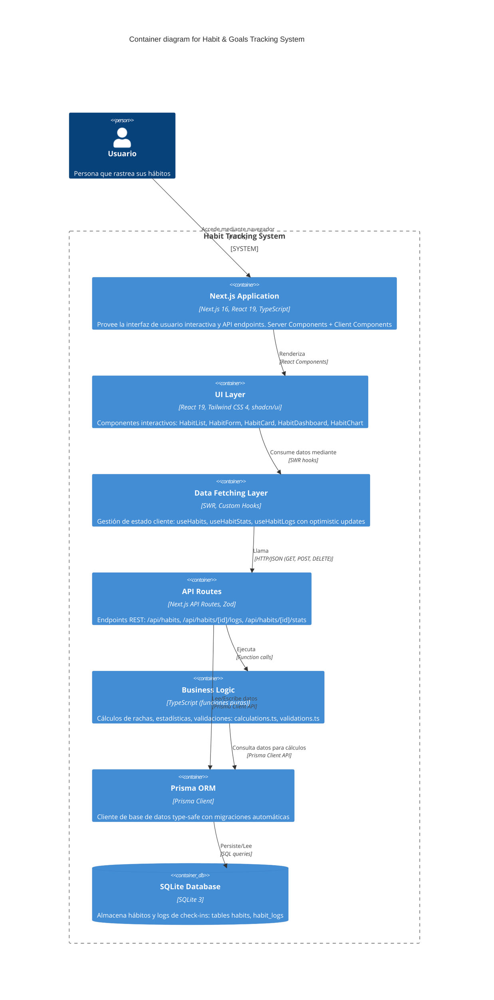

# C4 Model - Container Diagram (Level 2)
## Habit & Goals Tracking System

### Propósito
Este diagrama descompone el sistema en contenedores (aplicaciones, servicios, almacenes de datos), mostrando las tecnologías utilizadas y cómo se comunican entre sí.

### Diagrama



### Descripción de Contenedores

#### 1. Next.js Application (Aplicación Principal)
**Tecnología:** Next.js 16 (App Router), React 19, TypeScript  
**Responsabilidad:** Aplicación full-stack que sirve tanto frontend como backend

**Características:**
- App Router para routing basado en sistema de archivos
- Server Components por defecto (rendering del servidor)
- Client Components para interactividad ('use client')
- API Routes integradas para backend
- Hot Module Replacement para desarrollo
- Build optimizado con Turbopack

**Puertos:**
- Desarrollo: `http://localhost:3000`
- Producción: puerto configurado en deployment

---

#### 2. UI Layer (Capa de Presentación)
**Tecnología:** React 19, Tailwind CSS 4, shadcn/ui, Recharts  
**Responsabilidad:** Componentes visuales e interacción del usuario

**Componentes Principales:**

**HabitList**
- Lista grid responsivo de hábitos (1-3 columnas)
- Estados: loading (skeletons), vacío, error
- Botón "Crear Hábito" abre HabitForm

**HabitForm** 
- Dialog modal con formulario
- Inputs: nombre (required), descripción (optional), frecuencia (radio)
- Validación Zod client-side
- Loading state en botón submit

**HabitCard**
- Tarjeta con nombre, descripción, frecuencia (Badge)
- Indicador visual de racha: 🔥 (activa) / ⚫ (inactiva)
- Botón check-in (Checkbox) con optimistic update
- Botón "Ver detalles" → navegación a dashboard
- Botón eliminar con confirmación

**HabitDashboard**
- Vista individual con estadísticas detalladas
- Grid de métricas: racha actual, racha máxima, tasa cumplimiento, total logs
- Selector de rango temporal: 7/30/90 días
- Gráfico de progreso (línea o barras)

**HabitChart**
- Componente reutilizable con Recharts
- Tipos: line chart, bar chart
- Responsive container con tooltips
- Colores integrados con Tailwind theme

**Patrones de Diseño:**
- Mobile-first con breakpoints Tailwind (sm:, md:, lg:)
- Dark mode ready con clases `dark:`
- Componentes shadcn/ui: Button, Card, Badge, Input, Dialog, Checkbox

---

#### 3. Data Fetching Layer (Capa de Obtención de Datos)
**Tecnología:** SWR 2.x, Custom React Hooks  
**Responsabilidad:** Gestión de estado cliente, cache, revalidación

**Hooks Principales:**

**useHabits()**
```typescript
// Retorna: { habits, isLoading, error, createHabit, deleteHabit }
// Cache key: /api/habits
// Revalidación: onFocus, onReconnect
```

**useHabitStats(habitId, from?, to?)**
```typescript
// Retorna: { stats, isLoading, error }
// Cache key dinámica: /api/habits/${id}/stats?from=...&to=...
// Filtro temporal opcional
```

**useHabitLogs(habitId)**
```typescript
// Retorna: { createLog }
// Optimistic update en UI
// Revalida: useHabits + useHabitStats
```

**Configuración Global (SWRConfig):**
- `revalidateOnFocus: true` - actualiza al enfocar ventana
- `revalidateOnReconnect: true` - actualiza al reconectar
- `shouldRetryOnError: false` - no retry en 404/409
- Fetcher global con manejo de errores JSON

**Flujo de Optimistic Update:**
1. Usuario hace click en check-in
2. UI se actualiza inmediatamente (sin esperar respuesta)
3. POST request a API en background
4. Si falla: rollback automático + mensaje error
5. Si éxito: revalidación confirma estado

---

#### 4. API Routes (Capa de API REST)
**Tecnología:** Next.js API Routes, Zod  
**Responsabilidad:** Endpoints HTTP con validación y manejo de errores

**Endpoints:**

**GET /api/habits**
- Lista todos los hábitos ordenados por `createdAt` DESC
- Response: `Habit[]`
- Status: 200 OK, 500 Internal Server Error

**POST /api/habits**
- Crea nuevo hábito con validación Zod
- Body: `{ name: string, description?: string, frequency: 'daily' | 'weekly' }`
- Response: `Habit` creado
- Status: 201 Created, 400 Bad Request, 500 Internal Server Error

**DELETE /api/habits/[id]**
- Elimina hábito y logs asociados (cascade)
- Response: sin body
- Status: 204 No Content, 404 Not Found, 500 Internal Server Error

**POST /api/habits/[id]/logs**
- Registra check-in con timestamp automático
- Body: `{ note?: string }`
- Response: `HabitLog` creado
- Status: 201 Created, 404 Not Found, 409 Conflict (duplicado), 500 Internal Server Error

**GET /api/habits/[id]/stats**
- Retorna estadísticas calculadas
- Query params: `from?: Date, to?: Date`
- Response: `{ habitId, currentStreak, maxStreak, completionRate, nextExpectedDate, totalLogs }`
- Status: 200 OK, 404 Not Found, 500 Internal Server Error

**Manejo de Errores:**
```typescript
// Formato de respuesta de error
{
  error: string,        // Mensaje descriptivo
  code: string,         // Código de error (VALIDATION_ERROR, NOT_FOUND, etc.)
  details?: unknown     // Detalles adicionales (errores Zod, etc.)
}
```

---

#### 5. Business Logic (Lógica de Negocio)
**Tecnología:** TypeScript (funciones puras)  
**Responsabilidad:** Cálculos, validaciones, transformaciones de datos

**Módulos:**

**calculations.ts** - Cálculos de estadísticas
```typescript
calculateCurrentStreak(logs: HabitLog[], frequency: Frequency): number
calculateMaxStreak(logs: HabitLog[], frequency: Frequency): number
calculateCompletionRate(logs: HabitLog[], startDate: Date, frequency: Frequency): number
getNextExpectedDate(lastLog: HabitLog, frequency: Frequency): Date
```

**validations.ts** - Schemas Zod
```typescript
CreateHabitSchema: z.object({ name, description?, frequency })
CreateLogSchema: z.object({ habitId, note? })
StatsQuerySchema: z.object({ from?, to? })
```

**chartUtils.ts** - Transformación para gráficos
```typescript
transformLogsToChartData(logs: HabitLog[], groupBy: 'day' | 'week'): ChartDataPoint[]
```

**Principios:**
- Funciones puras (sin side effects)
- 100% testeables con unit tests
- Documentación JSDoc completa
- Separación de cálculo y persistencia

---

#### 6. Prisma ORM
**Tecnología:** Prisma Client 6.x  
**Responsabilidad:** Abstracción de base de datos type-safe

**Características:**
- Cliente generado desde schema (`prisma/schema.prisma`)
- Type-safety completo con TypeScript
- Migraciones automáticas (`prisma migrate`)
- Queries con autocompletado en IDE
- Relaciones y cascade deletes configurados

**Modelos:**
```prisma
model Habit {
  id: String @id @default(cuid())
  name: String
  description: String?
  frequency: String // 'daily' | 'weekly'
  logs: HabitLog[] // Relación 1:N
}

model HabitLog {
  id: String @id @default(cuid())
  habitId: String
  completedAt: DateTime @default(now())
  note: String?
  @@unique([habitId, completedAt]) // Previene duplicados
}
```

**Singleton Pattern:**
```typescript
// lib/prisma.ts - instancia única en desarrollo (HMR-safe)
declare global { var prisma: PrismaClient | undefined }
export const prisma = global.prisma || new PrismaClient()
```

---

#### 7. SQLite Database
**Tecnología:** SQLite 3  
**Responsabilidad:** Almacenamiento persistente embebido

**Características:**
- Archivo único: `prisma/habits.db`
- Sin servidor separado (embebido en aplicación)
- ACID compliant (transacciones)
- Ideal para escala personal (<1GB data)

**Tablas:**

**habits**
```sql
CREATE TABLE habits (
  id TEXT PRIMARY KEY,
  name TEXT NOT NULL,
  description TEXT,
  frequency TEXT NOT NULL,
  created_at DATETIME DEFAULT CURRENT_TIMESTAMP,
  updated_at DATETIME
);
```

**habit_logs**
```sql
CREATE TABLE habit_logs (
  id TEXT PRIMARY KEY,
  habit_id TEXT NOT NULL,
  completed_at DATETIME DEFAULT CURRENT_TIMESTAMP,
  note TEXT,
  created_at DATETIME DEFAULT CURRENT_TIMESTAMP,
  FOREIGN KEY (habit_id) REFERENCES habits(id) ON DELETE CASCADE,
  UNIQUE (habit_id, completed_at)
);
```

**Índices:**
- Primary keys en `id` (CUID format)
- Foreign key en `habit_logs.habit_id`
- Unique constraint en `(habit_id, completed_at)`
- Índice implícito en `created_at` para ordenamiento

---

### Flujo de Datos Completo

#### Escenario: Usuario registra check-in de hábito

1. **Usuario** hace click en checkbox de HabitCard
2. **UI Layer** ejecuta `useHabitLogs().createLog(habitId)`
3. **Data Fetching Layer (SWR)**:
   - Actualiza UI inmediatamente (optimistic update)
   - Envía POST a `/api/habits/[id]/logs`
4. **API Routes** recibe request:
   - Valida body con Zod
   - Verifica existencia de hábito
5. **Prisma ORM** ejecuta:
   ```typescript
   await prisma.habitLog.create({
     data: { habitId, completedAt: new Date() }
   })
   ```
6. **SQLite** persiste registro con unique constraint
7. **API Routes** retorna `HabitLog` con status 201
8. **SWR** revalida múltiples keys:
   - `/api/habits` (actualiza contador de logs en lista)
   - `/api/habits/${id}/stats` (recalcula racha)
9. **UI Layer** renderiza estado actualizado con nueva racha

#### Escenario: Usuario visualiza dashboard de hábito

1. **Usuario** navega a `/habits/[id]`
2. **UI Layer** renderiza HabitDashboard
3. **Data Fetching Layer** ejecuta `useHabitStats(id, { from, to })`
4. **API Routes** recibe GET `/api/habits/[id]/stats?from=...&to=...`
5. **Business Logic** calcula:
   - Query logs en rango temporal con Prisma
   - `calculateCurrentStreak(logs, frequency)`
   - `calculateMaxStreak(logs, frequency)`
   - `calculateCompletionRate(logs, startDate, frequency)`
6. **API Routes** retorna estadísticas calculadas
7. **UI Layer** renderiza:
   - Grid de métricas con Cards
   - HabitChart con datos transformados
8. **SWR** cachea resultado y revalida en focus

---

### Decisiones Técnicas Clave

#### ¿Por qué Next.js monolítico vs backend separado?
- **Simplicidad**: un solo proyecto, un solo deployment
- **Type-safety**: compartir tipos entre frontend/backend
- **Educacional**: stack unificado más fácil de aprender
- **Suficiente**: escala personal no requiere microservicios

#### ¿Por qué SQLite vs PostgreSQL?
- **Embebido**: sin servidor separado ni configuración
- **Portabilidad**: archivo único fácil de respaldar
- **Rendimiento**: suficiente para <100 hábitos
- **Educacional**: setup más simple para estudiantes

#### ¿Por qué SWR vs React Query?
- **Simplicidad**: API más minimal
- **Documentación**: excelentes ejemplos con Next.js
- **Tamaño**: más ligero (4kb vs 13kb)
- **Suficiente**: features cubren necesidades del MVP

#### ¿Por qué compute-on-read vs precomputed stats?
- **Simplicidad**: lógica más fácil de entender
- **Exactitud**: siempre actualizado
- **Educacional**: demuestra cálculos de rachas claramente
- **Rendimiento**: aceptable para escala personal

---

### Seguridad y Consideraciones

**Validación:**
- Input validation con Zod en API routes
- Type-safety con TypeScript end-to-end
- Sanitización automática por Prisma

**Errores:**
- No exponer stack traces en producción
- Logging estructurado de errores
- Manejo graceful de constraint violations

**Limitaciones:**
- Sin autenticación (single-user MVP)
- Sin rate limiting
- Sin CORS restrictions
- Sin encryption at rest

---

### Tecnologías y Versiones

| Componente | Tecnología | Versión |
|-----------|-----------|---------|
| Runtime | Node.js | 20+ |
| Framework | Next.js | 16.0.6 |
| UI Library | React | 19.2.0 |
| Language | TypeScript | 5.x |
| Styling | Tailwind CSS | 4.0.0 |
| UI Components | shadcn/ui | Latest |
| Charts | Recharts | 2.x |
| Data Fetching | SWR | 2.x |
| Validation | Zod | 4.x |
| ORM | Prisma | 6.x |
| Database | SQLite | 3.x |
| Testing | Vitest | 4.x |
| E2E Testing | Playwright | Latest |

### Referencias
- [Next.js App Router Docs](https://nextjs.org/docs/app)
- [Prisma Docs](https://www.prisma.io/docs)
- [SWR Documentation](https://swr.vercel.app)
- [Tailwind CSS v4](https://tailwindcss.com/docs)
