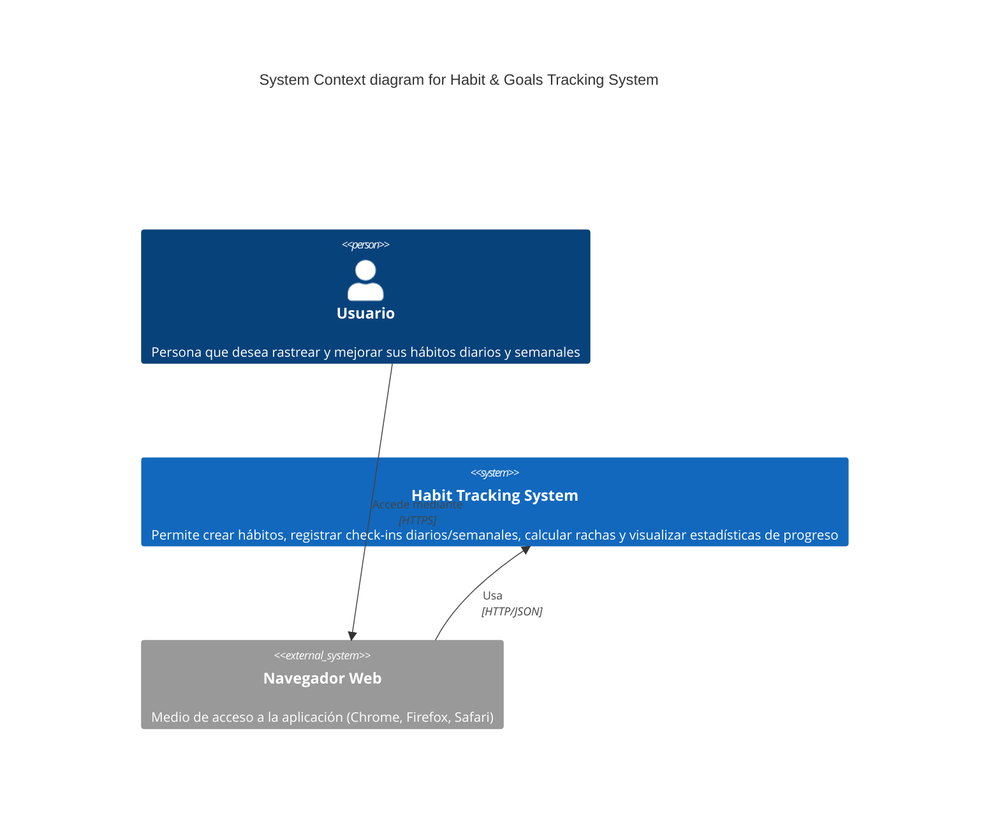

# C4 Model - Context Diagram (Level 1)
## Habit & Goals Tracking System

### Propósito
Este diagrama muestra el contexto del sistema de seguimiento de hábitos y metas, identificando los actores externos y el alcance general del MVP.

### Diagrama

### Descripción de Elementos

#### Actores

**Usuario**
- Persona que busca mejorar su disciplina mediante el seguimiento de hábitos
- Crea hábitos con nombre, descripción y frecuencia (diaria/semanal)
- Registra check-ins cuando completa un hábito
- Visualiza estadísticas: rachas actuales/máximas, tasa de cumplimiento
- Consulta gráficos de progreso temporal

#### Sistemas

**Habit Tracking System** (Sistema Principal)
- Aplicación web full-stack de página única (SPA)
- Gestión completa de hábitos: crear, eliminar (sin edición en MVP)
- Registro de check-ins con timestamps automáticos
- Cálculo de estadísticas en tiempo real (compute-on-read)
- Visualización interactiva con gráficos responsivos
- Almacenamiento persistente en base de datos SQLite embebida

**Navegador Web** (Sistema Externo)
- Cliente HTTP que renderiza la interfaz de usuario
- Ejecuta JavaScript de la aplicación React
- Gestiona cookies y localStorage para caché de SWR
- Soporta navegadores modernos (Chrome, Firefox, Safari, Edge)

### Flujo de Interacción Principal

1. **Usuario** accede a la aplicación mediante **Navegador Web** a través de HTTPS
2. **Navegador** carga la aplicación desde **Habit Tracking System**
3. **Usuario** interactúa con la UI para crear hábitos o registrar check-ins
4. **Habit Tracking System** procesa las peticiones y persiste datos
5. **Sistema** calcula estadísticas en tiempo real y retorna datos actualizados
6. **Usuario** visualiza resultados y gráficos en tiempo real

### Alcance del MVP

**Incluido:**
- ✅ Crear y eliminar hábitos
- ✅ Registrar check-ins diarios y semanales
- ✅ Cálculo automático de rachas (actuales y máximas)
- ✅ Tasa de cumplimiento porcentual
- ✅ Visualización con gráficos interactivos
- ✅ Dashboard individual por hábito
- ✅ Interfaz responsiva (mobile-first)

**Excluido del MVP:**
- ❌ Edición de hábitos existentes
- ❌ Backfill de check-ins históricos
- ❌ Autenticación/multi-usuario
- ❌ Notificaciones push o recordatorios
- ❌ Integración con servicios externos
- ❌ Exportación de datos (CSV, PDF)
- ❌ Categorías o etiquetas de hábitos
- ❌ Gamificación avanzada (logros, badges)

### Supuestos y Restricciones

**Supuestos:**
- Usuario único por instancia (sin autenticación)
- Uso en dispositivos con navegadores modernos
- Conectividad estable durante uso activo
- Escala personal: <100 hábitos, ~1000 logs

**Restricciones:**
- Base de datos SQLite embebida (no distribuida)
- Sin soporte offline nativo (caché del navegador limitado)
- Deployment en entorno local o single-server
- Sin requerimientos de auditoría o compliance
