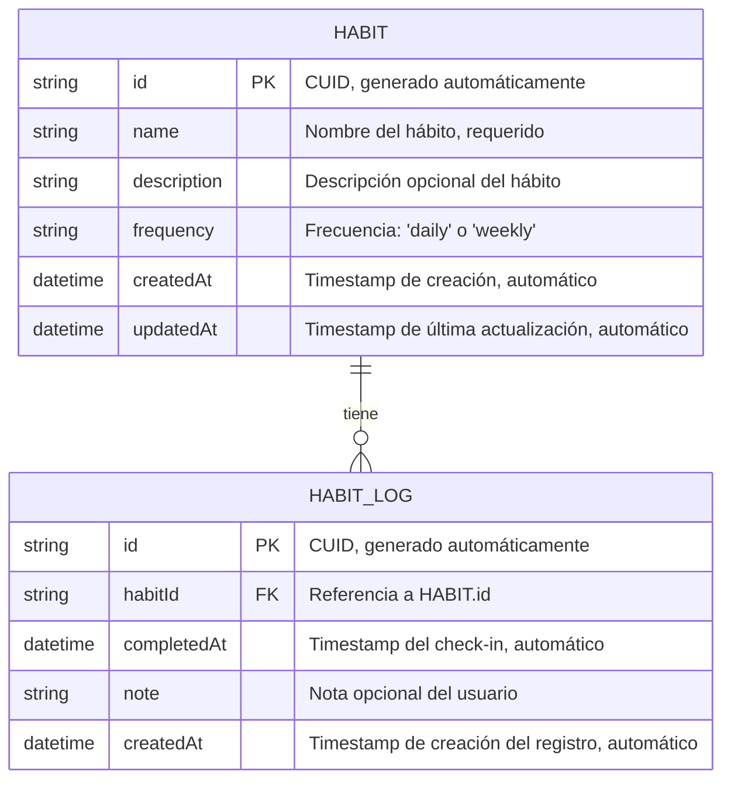

# Entity-Relationship Diagram
## Habit & Goals Tracking System - Database Schema

### Propósito
Este diagrama documenta el modelo de datos del sistema, mostrando las entidades, sus atributos, relaciones y constraints. El diseño está validado contra el schema Prisma existente.

### Diagrama ER



### Descripción de Entidades

---

#### HABIT (Hábito)
Representa un hábito que el usuario desea rastrear y completar regularmente.

**Atributos:**

| Campo | Tipo | Constraints | Descripción |
|-------|------|-------------|-------------|
| `id` | String | PRIMARY KEY, NOT NULL | Identificador único generado con CUID. Formato: `cld3gk5j80000...` |
| `name` | String | NOT NULL | Nombre descriptivo del hábito. Ej: "Hacer ejercicio", "Leer 30 minutos" |
| `description` | String | NULLABLE | Descripción detallada opcional. Ej: "Correr 5km cada mañana" |
| `frequency` | String | NOT NULL | Frecuencia esperada: `'daily'` (diario) o `'weekly'` (semanal) |
| `createdAt` | DateTime | NOT NULL, DEFAULT now() | Timestamp de creación del hábito. Generado automáticamente |
| `updatedAt` | DateTime | NOT NULL | Timestamp de última modificación. Actualizado automáticamente por Prisma |

**Reglas de Negocio:**
- El campo `name` no puede estar vacío (validación en aplicación)
- El campo `frequency` debe ser exactamente `'daily'` o `'weekly'` (validación Zod)
- No se permite edición de hábitos en MVP (solo crear/eliminar)
- La eliminación de un hábito elimina todos sus logs asociados (CASCADE)

**Ejemplos de datos:**
```json
{
  "id": "cld3gk5j80000abc123def456",
  "name": "Meditar",
  "description": "10 minutos de meditación guiada",
  "frequency": "daily",
  "createdAt": "2025-12-09T10:30:00.000Z",
  "updatedAt": "2025-12-09T10:30:00.000Z"
}
```

---

#### HABIT_LOG (Registro de Check-in)
Representa un registro individual de completitud de un hábito en un momento específico.

**Atributos:**

| Campo | Tipo | Constraints | Descripción |
|-------|------|-------------|-------------|
| `id` | String | PRIMARY KEY, NOT NULL | Identificador único generado con CUID |
| `habitId` | String | FOREIGN KEY, NOT NULL | Referencia a `HABIT.id`. Establece relación con hábito |
| `completedAt` | DateTime | NOT NULL, DEFAULT now() | Timestamp exacto del check-in. Generado automáticamente |
| `note` | String | NULLABLE | Nota opcional del usuario. Ej: "Corrí 6km hoy, me sentí genial" |
| `createdAt` | DateTime | NOT NULL, DEFAULT now() | Timestamp de creación del registro en base de datos |

**Constraints:**
- **UNIQUE(habitId, completedAt)**: Previene duplicados exactos. No se puede registrar el mismo hábito en el mismo timestamp
- **ON DELETE CASCADE**: Al eliminar un hábito, todos sus logs se eliminan automáticamente

**Reglas de Negocio:**
- El timestamp `completedAt` siempre refleja el momento actual (no se permite backfill en MVP)
- El constraint único permite máximo 1 check-in por hábito por timestamp exacto
- Un hábito puede tener 0 o más logs (relación 1:N)
- Los logs solo pueden ser creados, no editados ni eliminados individualmente

**Ejemplos de datos:**
```json
{
  "id": "cld3gk5j80001xyz789ghi012",
  "habitId": "cld3gk5j80000abc123def456",
  "completedAt": "2025-12-09T08:15:00.000Z",
  "note": "Excelente sesión de 15 minutos",
  "createdAt": "2025-12-09T08:15:00.000Z"
}
```

---

### Relaciones

#### HABIT → HABIT_LOG (1:N)
**Tipo:** Uno a Muchos  
**Cardinalidad:** Un hábito puede tener cero o más registros de check-in

**Semántica:**
- Un `HABIT` **tiene** muchos `HABIT_LOG`
- Un `HABIT_LOG` **pertenece a** un único `HABIT`

**Implementación:**
- Campo `habitId` en tabla `habit_logs` referencia `id` en tabla `habits`
- Constraint `FOREIGN KEY (habitId) REFERENCES habits(id) ON DELETE CASCADE`

**Integridad Referencial:**
- **Inserción**: No se puede crear un `HABIT_LOG` sin un `HABIT` existente (API retorna 404)
- **Eliminación**: Al eliminar un `HABIT`, todos sus `HABIT_LOG` se eliminan automáticamente (CASCADE)
- **Actualización**: `habitId` no es modificable una vez creado el log

**Queries Comunes:**
```typescript
// Obtener hábito con todos sus logs
await prisma.habit.findUnique({
  where: { id: habitId },
  include: { logs: true }
})

// Obtener logs de un hábito con filtro temporal
await prisma.habitLog.findMany({
  where: {
    habitId,
    completedAt: {
      gte: new Date('2025-12-01'),
      lte: new Date('2025-12-31')
    }
  },
  orderBy: { completedAt: 'desc' }
})
```

---

### Índices y Performance

#### Índices Implícitos (Automáticos)

**Primary Keys:**
- `habits.id` - índice único automático
- `habit_logs.id` - índice único automático

**Foreign Keys:**
- `habit_logs.habitId` - índice automático para joins eficientes

**Unique Constraints:**
- `habit_logs(habitId, completedAt)` - índice compuesto único

#### Índices Recomendados para Producción

Si la escala crece, considerar agregar:

```sql
-- Para queries de estadísticas ordenadas por fecha
CREATE INDEX idx_habit_logs_completed_at 
ON habit_logs(completed_at DESC);

-- Para queries de hábitos recientes
CREATE INDEX idx_habits_created_at 
ON habits(created_at DESC);
```

**Justificación:**
- Queries de estadísticas frecuentemente filtran y ordenan por `completedAt`
- Dashboard principal lista hábitos ordenados por `createdAt`
- Con <1000 logs, estos índices son opcionales pero mejoran performance

---

### Constraints y Validaciones

#### Nivel Base de Datos (SQLite)

**NOT NULL:**
- `habits.id`, `habits.name`, `habits.frequency`
- `habit_logs.id`, `habit_logs.habitId`, `habit_logs.completedAt`

**PRIMARY KEY:**
- `habits.id`
- `habit_logs.id`

**FOREIGN KEY:**
```sql
FOREIGN KEY (habit_logs.habitId) 
REFERENCES habits(id) 
ON DELETE CASCADE
```

**UNIQUE:**
```sql
UNIQUE (habit_logs.habitId, habit_logs.completedAt)
```

#### Nivel Aplicación (Zod + TypeScript)

**CreateHabitSchema:**
```typescript
z.object({
  name: z.string().min(1).max(100), // no vacío, máximo 100 caracteres
  description: z.string().max(500).optional(), // máximo 500 caracteres
  frequency: z.enum(['daily', 'weekly']) // solo valores permitidos
})
```

**CreateLogSchema:**
```typescript
z.object({
  habitId: z.string().cuid(), // validar formato CUID
  note: z.string().max(500).optional() // máximo 500 caracteres
})
```

---

### Migraciones Prisma

#### Migración Inicial (20251202193751_init)

```sql
-- CreateTable: habits
CREATE TABLE "habits" (
    "id" TEXT NOT NULL PRIMARY KEY,
    "name" TEXT NOT NULL,
    "description" TEXT,
    "frequency" TEXT NOT NULL,
    "createdAt" DATETIME NOT NULL DEFAULT CURRENT_TIMESTAMP,
    "updatedAt" DATETIME NOT NULL
);

-- CreateTable: habit_logs
CREATE TABLE "habit_logs" (
    "id" TEXT NOT NULL PRIMARY KEY,
    "habitId" TEXT NOT NULL,
    "completedAt" DATETIME NOT NULL DEFAULT CURRENT_TIMESTAMP,
    "note" TEXT,
    "createdAt" DATETIME NOT NULL DEFAULT CURRENT_TIMESTAMP,
    CONSTRAINT "habit_logs_habitId_fkey" 
        FOREIGN KEY ("habitId") 
        REFERENCES "habits" ("id") 
        ON DELETE CASCADE ON UPDATE CASCADE
);

-- CreateIndex: Unique constraint
CREATE UNIQUE INDEX "habit_logs_habitId_completedAt_key" 
ON "habit_logs"("habitId", "completedAt");
```

**Comandos:**
```bash
# Crear migración
npx prisma migrate dev --name init

# Aplicar migraciones
npx prisma migrate deploy

# Resetear base de datos (desarrollo)
npx prisma migrate reset
```

---

### Schema Prisma (Validado)

```prisma
generator client {
  provider = "prisma-client-js"
}

datasource db {
  provider = "sqlite"
  url      = "file:./habits.db"
}

model Habit {
  id          String     @id @default(cuid())
  name        String
  description String?
  frequency   String     // 'daily' | 'weekly'
  createdAt   DateTime   @default(now())
  updatedAt   DateTime   @updatedAt
  logs        HabitLog[]

  @@map("habits")
}

model HabitLog {
  id          String   @id @default(cuid())
  habitId     String
  habit       Habit    @relation(fields: [habitId], references: [id], onDelete: Cascade)
  completedAt DateTime @default(now())
  note        String?
  createdAt   DateTime @default(now())

  @@unique([habitId, completedAt])
  @@map("habit_logs")
}
```

**Correspondencia con ER:**
- ✅ Todas las entidades y atributos coinciden
- ✅ Relación 1:N correctamente definida
- ✅ Constraints de unicidad y CASCADE implementados
- ✅ Defaults y timestamps automáticos configurados

---

### Tipos TypeScript Generados

Prisma genera automáticamente tipos TypeScript desde el schema:

```typescript
// Generado por Prisma Client
type Habit = {
  id: string
  name: string
  description: string | null
  frequency: string
  createdAt: Date
  updatedAt: Date
}

type HabitLog = {
  id: string
  habitId: string
  completedAt: Date
  note: string | null
  createdAt: Date
}

// Tipo con relación incluida
type HabitWithLogs = Habit & {
  logs: HabitLog[]
}
```

**Uso en aplicación:**
```typescript
import { Habit, HabitLog } from '@prisma/client'

// Type-safe en toda la aplicación
const habit: Habit = await prisma.habit.findUnique(...)
const logs: HabitLog[] = await prisma.habitLog.findMany(...)
```

---

### Ejemplos de Queries

#### Crear hábito
```typescript
const habit = await prisma.habit.create({
  data: {
    name: "Leer 30 minutos",
    description: "Leer un libro de ficción o técnico",
    frequency: "daily"
  }
})
```

#### Registrar check-in
```typescript
const log = await prisma.habitLog.create({
  data: {
    habitId: "cld3gk5j80000abc123def456",
    note: "Leí capítulo 5 de Clean Code"
  }
})
```

#### Obtener hábito con logs (para cálculo de estadísticas)
```typescript
const habitWithLogs = await prisma.habit.findUnique({
  where: { id: habitId },
  include: {
    logs: {
      where: {
        completedAt: {
          gte: new Date('2025-12-01'),
          lte: new Date('2025-12-31')
        }
      },
      orderBy: { completedAt: 'desc' }
    }
  }
})
```

#### Eliminar hábito (cascade delete de logs)
```typescript
await prisma.habit.delete({
  where: { id: habitId }
})
// Todos los habit_logs con habitId se eliminan automáticamente
```

#### Listar todos los hábitos con conteo de logs
```typescript
const habits = await prisma.habit.findMany({
  include: {
    _count: {
      select: { logs: true }
    }
  },
  orderBy: { createdAt: 'desc' }
})
// Retorna: [{ ...habit, _count: { logs: 10 } }, ...]
```

---

### Consideraciones de Escalabilidad

#### Límites del Diseño Actual

**Escala soportada:**
- ✅ Hasta 100 hábitos activos
- ✅ Hasta 10,000 logs totales
- ✅ Queries de estadísticas <100ms

**Posibles cuellos de botella:**
- ❌ Cálculo de estadísticas en memoria (sin agregaciones SQL)
- ❌ Sin paginación en endpoints
- ❌ Sin índices especializados para queries temporales
- ❌ Sin tabla de estadísticas pre-calculadas

#### Mejoras Futuras (si se necesita escalar)

**1. Tabla de estadísticas pre-calculadas:**
```prisma
model HabitStats {
  id               String   @id @default(cuid())
  habitId          String   @unique
  currentStreak    Int
  maxStreak        Int
  completionRate   Float
  lastCalculatedAt DateTime @default(now())
  
  habit Habit @relation(fields: [habitId], references: [id], onDelete: Cascade)
}
```

**2. Agregaciones con Prisma:**
```typescript
// En lugar de calcular en memoria
const stats = await prisma.habitLog.aggregate({
  where: { habitId },
  _count: { id: true },
  _min: { completedAt: true },
  _max: { completedAt: true }
})
```

**3. Vistas materializadas (si se migra a PostgreSQL):**
```sql
CREATE MATERIALIZED VIEW habit_stats_mv AS
SELECT 
  habit_id,
  COUNT(*) as total_logs,
  MIN(completed_at) as first_log,
  MAX(completed_at) as last_log
FROM habit_logs
GROUP BY habit_id;
```

---

### Integridad de Datos

#### Garantías del Sistema

**Atomicidad:**
- Cada operación Prisma es atómica (transacción implícita)
- Uso de transacciones explícitas si se requiere consistencia multi-tabla

**Consistencia:**
- Constraints de base de datos aseguran integridad referencial
- Validación Zod previene datos inválidos antes de persistir

**Aislamiento:**
- SQLite usa transacciones serializables por defecto
- Sin problemas de concurrencia en contexto single-user

**Durabilidad:**
- SQLite escribe a disco inmediatamente (journal_mode=WAL)
- Respaldos simples: copiar archivo `habits.db`

#### Manejo de Errores Comunes

**Unique constraint violation:**
```typescript
try {
  await prisma.habitLog.create({ data: { habitId, completedAt } })
} catch (error) {
  if (error.code === 'P2002') {
    return res.status(409).json({ 
      error: 'Ya registraste este hábito en este momento' 
    })
  }
}
```

**Foreign key constraint:**
```typescript
try {
  await prisma.habitLog.create({ data: { habitId: 'invalid' } })
} catch (error) {
  if (error.code === 'P2003') {
    return res.status(404).json({ 
      error: 'Hábito no encontrado' 
    })
  }
}
```

---

### Referencias

- **Prisma Schema Reference:** https://www.prisma.io/docs/reference/api-reference/prisma-schema-reference
- **SQLite Documentation:** https://www.sqlite.org/docs.html
- **CUID Specification:** https://github.com/paralleldrive/cuid
- **Mermaid ER Diagrams:** https://mermaid.js.org/syntax/entityRelationshipDiagram.html
